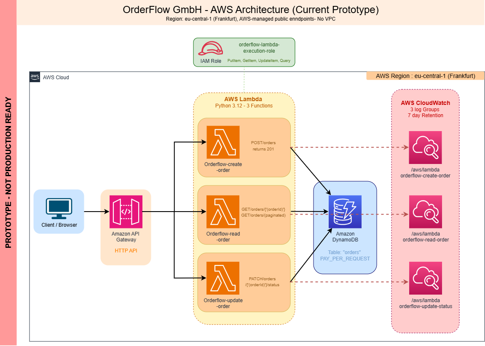

# OrderFlow GmbH (AWS Serverless Order Management System)

A fully serverless order management backend built on AWS, designed as a 4-week final project for my Cloud and AWS training program at DCI.

OrderFlow GmbH is a small business that sells products through an online platform. As customer volume grows, the company needs a scalable, cost-efficient backend to create, retrieve, and update customer orders through APIs. All done without managing any servers.

This project demonstrates the complete journey from business requirements to a production-ready serverless architecture:

**Business Requirements → API Design → Data Modeling → Serverless Implementation → Business Rules → Security → Monitoring → Scalability → Cost → Terraform**

---

## Architecture Overview

```
         Client (curl / Postman)
                  │
                  ▼
        ┌─────────────────┐
        │  API Gateway    │   (HTTP API)
        │  (eu-central-1) │
        └────────┬────────┘
                 │
     ┌───────────┼───────────┐
     ▼           ▼           ▼
 ┌────────┐ ┌────────┐ ┌────────┐
 │ Create │ │  Read  │ │ Update │
 │ Order  │ │ Order  │ │ Status │
 │ Lambda │ │ Lambda │ │ Lambda │
 └───┬────┘ └───┬────┘ └───┬────┘
     │           │         │
     └───────────┼─────────┘
                 ▼
        ┌─────────────────┐
        │    DynamoDB     │
        │  (orders table) │
        └────────┬────────┘
                 ▼
        ┌─────────────────┐
        │   CloudWatch    │
        │  (Logs & Alarms)│
        └─────────────────┘
```

**AWS Services Used:**

| Service | Purpose |
|---|---|
| Amazon API Gateway (HTTP API) | REST API endpoint for all client requests |
| AWS Lambda (Python 3.12) | Serverless compute — one function per operation |
| Amazon DynamoDB | NoSQL database for order storage (PAY_PER_REQUEST) |
| AWS IAM | Least-privilege roles and policies for Lambda |
| Amazon CloudWatch | Logging, metrics, and alarms |
| Terraform | Infrastructure as Code for all AWS resources |

---

## AWS Architecture Diagram of the Prototype




---

## Prerequisites

Before deploying this project, you need the following installed and configured on your machine:

### Software

| Tool | Version | Purpose |
|---|---|---|
| [AWS CLI](https://docs.aws.amazon.com/cli/latest/userguide/getting-started-install.html) | v2.x | Interact with AWS from the command line |
| [Terraform](https://developer.hashicorp.com/terraform/tutorials/aws-get-started/install-cli) | v1.5+ | Deploy infrastructure as code |
| [Python](https://www.python.org/downloads/) | 3.12 | Lambda runtime language |
| [Git](https://git-scm.com/downloads) | Latest | Version control |
| [VS Code](https://code.visualstudio.com/) (recommended) | Latest | Code editor |

### AWS Account Setup

1. **AWS Account** — A personal AWS account ([sign up here](https://aws.amazon.com/free/))
2. **IAM User** — An IAM user with `AdministratorAccess` policy attached (for learning purposes only — see Security section for production recommendations)
3. **AWS CLI configured** — Run `aws configure` with your IAM user credentials:
   ```
   AWS Access Key ID:     <your-access-key>
   AWS Secret Access Key: <your-secret-key>
   Default region:        eu-central-1
   Default output format: json
   ```
4. **Verify access** — Confirm your CLI works:
   ```bash
   aws sts get-caller-identity
   ```
   You should see your account ID and IAM user ARN.

### Costs

This project is designed to stay within the **AWS Free Tier**. The services used (API Gateway, Lambda, DynamoDB on-demand) have generous free-tier allowances. Estimated cost for development and testing is **$0.00** under normal usage.

---

## Repository Structure

```
serverless-order-management/
│
├── README.md                          ← You are here
├── demo.ps1                           ← PowerShell script to run all 7 API tests
├── .gitignore
├── LICENSE
│
├── week-1-design/                     ← Requirements, API design & data modeling
│   ├── business-requirements.md
│   ├── technical-requirements.md
│   ├── assumptions.md
│   ├── state-machine.md
│   ├── transition-rules.md
│   ├── endpoints.md
│   ├── api-documentation.md
│   ├── dynamodb-design.md
│   ├── access-patterns.md
│   ├── architecture-decisions.md
│   ├── architecturediagram.drawio.png
│   ├── request-flow.md
│   └── test-cases.md
│
├── week-2-implementation/             ← Terraform IaC + Lambda functions
│   ├── terraform/
│   │   ├── main.tf                    ← All AWS resources (API GW, Lambda, DynamoDB, IAM)
│   │   ├── variables.tf               ← Configurable parameters
│   │   └── outputs.tf                 ← Prints API URL after deploy
│   └── lambda/
│       ├── create_order/handler.py    ← POST /orders
│       ├── read_order/handler.py      ← GET /orders & GET /orders/{orderId}
│       └── update_status/handler.py   ← PATCH /orders/{orderId}/status
│
├── week-3-security-monitoring/        ← Security review, monitoring & reliability
│   ├── iam-design.md
│   ├── monitoring-design.md
│   └── consistency-and-failure-handling.md
│
└── week-4-finalization/               ← Networking, DR, cost & Well-Architected review
    ├── networking-design.md
    ├── disaster-recovery.md
    ├── cost-analysis.md
    └── well-architected-review.md
```

---

## Deployment Guide

### Step 1 — Clone the Repository

```bash
git clone https://github.com/yasaswipaladugu/serverless-order-management.git
cd serverless-order-management
```

### Step 2 — Initialize Terraform

```bash
cd week-2-implementation/terraform
terraform init
```

### Step 3 — Review the Plan

```bash
terraform plan
```

This shows you exactly what AWS resources Terraform will create — review it before applying.

### Step 4 — Deploy to AWS

```bash
terraform apply
```

Type `yes` when prompted. Terraform will create:
- 1 DynamoDB table (`orders`)
- 3 Lambda functions
- 1 API Gateway (HTTP API) with 4 routes
- 1 IAM role + policy (least privilege)
- 3 CloudWatch Log Groups

After deployment, Terraform prints the **API Base URL**:

```
api_url = "https://xxxxxxxxxx.execute-api.eu-central-1.amazonaws.com"
```

Save this URL — you need it for all API calls.

### Step 5 — Verify Deployment

```bash
curl https://<your-api-url>/orders
```

You should receive a `200` response with an empty order list.

---

## API Endpoints

**Base URL:** `https://cu0qh9j5d7.execute-api.eu-central-1.amazonaws.com`

### Create Order

```
POST /orders
```

**Request Body:**
```json
{
  "customerId": "C1001",
  "items": [
    { "productId": "P100", "quantity": 2 }
  ],
  "totalAmount": 49.98
}
```

**Response (201 Created):**
```json
{
  "orderId": "ord-xxxxxxxx-xxxx-xxxx-xxxx-xxxxxxxxxxxx",
  "customerId": "C1001",
  "items": [{ "productId": "P100", "quantity": 2 }],
  "totalAmount": 49.98,
  "status": "PENDING",
  "createdAt": "2025-08-01T10:30:00Z"
}
```

### Get Single Order

```
GET /orders/{orderId}
```

**Response (200 OK):** Returns the full order object.

**Response (404 Not Found):** If the order ID does not exist.

### List All Orders

```
GET /orders
```

Returns all orders using DynamoDB **Query** (not Scan) with base64 pagination support. This design ensures efficient retrieval as the number of orders grows.

### Update Order Status

```
PATCH /orders/{orderId}/status
```

**Request Body:**
```json
{
  "status": "CONFIRMED"
}
```

**Response (200 OK):** Order updated successfully.

**Response (409 Conflict):** If the transition is not allowed by the state machine.

---

## Order Lifecycle & State Machine

Every order moves through a defined lifecycle. The system **enforces** valid transitions and **rejects** invalid ones:

```
              ┌────────────┐
              │   PENDING  │
              └──┬───────┬─┘
                 │       │
          ┌──────▼──┐    │
          │CONFIRMED│    │
          └──┬────┬─┘    │
             │    │      │
     ┌───────▼┐   │      │
     │PROCESS-│   │      │
     │  ING   │   │      │
     └───┬────┘   │      │
         │        │      │
     ┌───▼────┐   │      │
     │SHIPPED │   │      │
     └───┬────┘   │      │
         │        │      │
   ┌─────▼─────┐  │      │
   │ DELIVERED │  │      │
   └───────────┘  │      │
                  ▼      ▼
            ┌───────────┐
            │ CANCELLED │
            └───────────┘
```

### Allowed Transitions

| Current Status | Allowed Next Status |
|---|---|
| PENDING | CONFIRMED, CANCELLED |
| CONFIRMED | PROCESSING, CANCELLED |
| PROCESSING | SHIPPED |
| SHIPPED | DELIVERED |
| DELIVERED | *(terminal — no further transitions)* |
| CANCELLED | *(terminal — no further transitions)* |

### How It Works

- Transition rules are enforced in the `update_status` Lambda using an `ALLOWED_TRANSITIONS` dictionary.
- DynamoDB **ConditionExpression** provides optimistic locking — the update only succeeds if the current status in the database matches what the caller expects. This prevents race conditions when two users try to update the same order simultaneously.
- Invalid transitions return HTTP `409 Conflict` with a clear error message explaining why the transition was rejected.

---

## Testing

All 7 test scenarios pass successfully:

| # | Test | Method | Expected | Result |
|---|---|---|---|---|
| 1 | Create a new order | POST /orders | 201 Created | ✅ Pass |
| 2 | Retrieve an order by ID | GET /orders/{orderId} | 200 OK | ✅ Pass |
| 3 | List all orders | GET /orders | 200 OK (Query, not Scan) | ✅ Pass |
| 4 | Valid status transition (PENDING → CONFIRMED) | PATCH /orders/{orderId}/status | 200 OK | ✅ Pass |
| 5 | Invalid status transition (CONFIRMED → PENDING) | PATCH /orders/{orderId}/status | 409 Conflict | ✅ Pass |
| 6 | Create order with missing fields | POST /orders | 400 Bad Request | ✅ Pass |
| 7 | Retrieve non-existent order | GET /orders/{orderId} | 404 Not Found | ✅ Pass |

### Running the Tests

Use the included PowerShell demo script:

```powershell
.\demo.ps1
```

This script runs all 7 tests step by step against the live API and shows the response for each.

---

## Key Design Decisions

| Decision | Choice | Rationale |
|---|---|---|
| Compute | Lambda over EC2 | No servers to manage; automatic scaling; pay only per request |
| Database | DynamoDB over RDS | Serverless, millisecond latency, scales automatically, no connection management |
| API | API Gateway HTTP API | Lower cost than REST API, sufficient for this use case, native Lambda integration |
| IaC | Terraform | Multi-cloud compatible, declarative, reproducible infrastructure |
| DynamoDB Key Design | PK = "ORDER" (fixed), SK = orderId | Enables Query on all orders without expensive Scan operations |
| State Validation | Application-layer enforcement | Business rules belong in code, not in the database |
| Concurrency Control | DynamoDB ConditionExpression | Optimistic locking prevents conflicting updates without table-level locks |

For detailed decision analysis, see [week-1-design/architecture-decisions.md](week-1-design/architecture-decisions.md).

---

## Project Timeline

| Week | Focus | Status |
|---|---|---|
| Week 1 | Requirements, API Design & Data Modeling | ✅ Complete |
| Week 2 | Terraform + Lambda + API Gateway Implementation | ✅ Complete |
| Week 3 | Security Review, Monitoring & Reliability | ✅ Complete |
| Week 4 | Networking, DR, Cost Analysis & Well-Architected Review | ✅ Complete |

---

## Prototype Disclaimer

> **This project is a learning prototype** built as a final project for an AWS cloud training program. It demonstrates serverless architecture patterns, infrastructure as code, and AWS best practices at an introductory level.
>
> **It is not production-ready.** A production system would require additional capabilities such as:
>
> - **Authentication & Authorization** — Amazon Cognito or API keys to secure the API
> - **VPC Networking** — Private subnets for Lambda, VPC endpoints for DynamoDB
> - **CI/CD Pipeline** — Automated testing and deployment via AWS CodePipeline or GitHub Actions
> - **Multi-Region Deployment** — DynamoDB Global Tables and cross-region failover
> - **Input Sanitization** — Protection against injection attacks
> - **Rate Limiting & WAF** — API Gateway throttling and AWS WAF for DDoS protection
> - **Secrets Management** — AWS Secrets Manager for sensitive configuration
> - **Observability** — AWS X-Ray for distributed tracing, structured logging, custom dashboards
> - **Backup & Recovery** — DynamoDB Point-in-Time Recovery (PITR), automated backups
> - **Event-Driven Extensions** — DynamoDB Streams + SNS/SQS for notifications, analytics, and downstream processing
>
> See [week-4-finalization/well-architected-review.md](week-4-finalization/well-architected-review.md) for a detailed analysis of how this prototype maps to the AWS Well-Architected Framework and the improvements needed for industry-grade deployment.

---

## Author

**Yasaswi Paladugu**
DCI Digital Career Institute — Cloud & AWS Program

