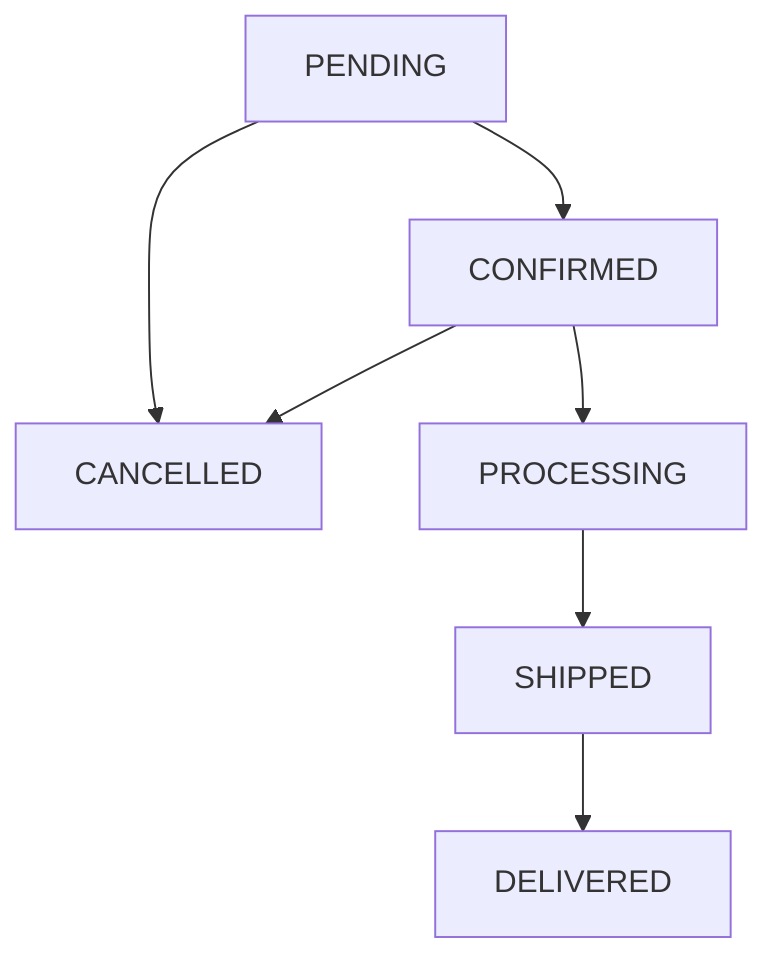

# Order State Machine

## 1. What is a State Machine?

- A state machine is a way of describing a system that can be in exactly one
state at any given time, and that can move between states only through
defined, allowed transitions.
- In this project, every order has a status. That status is the current state
of the order. The order can only move from one status to another if the
transition is explicitly allowed by the business rules.
- This approach ensures that an order can never end up in an impossible or
inconsistent situation — for example, moving from DELIVERED back to PENDING,
or from CANCELLED to SHIPPED.

---

## 2. States

- The OrderFlow system defines six possible order states.
1. PENDING is the initial state. Every new order starts here.
It means the order has been received but not yet reviewed or accepted.
2. CONFIRMED means the order has been reviewed and accepted for fulfillment.
The business has committed to processing this order.
3. PROCESSING means the order is actively being prepared for shipment.
Physical goods may be picked, packed, or assembled at this stage.
4. SHIPPED means the order has been handed to a carrier and is in transit.
The order has left the warehouse.
5. DELIVERED means the order has been received by the customer.
This is a final state. No further transitions are possible.
6. CANCELLED means the order has been cancelled.
This is a final state. No further transitions are possible.

---

## 3. State Diagram

The following diagram shows all valid transitions between states.

The two final states, DELIVERED and CANCELLED, have no outgoing transitions.
Once an order reaches either of these states, it cannot be changed.

---

## 4. Initial State

- Every order is created with the status PENDING.This is assigned automatically by the system at the moment of creation.
- The caller does not specify the initial status.

---

## 5. Final States

- DELIVERED is a final state. An order that has been delivered is complete.
No further status changes are allowed.
- CANCELLED is a final state. An order that has been cancelled is closed.
No further status changes are allowed, including re-opening or re-activating the order.

---

## 6. Where the State Machine Lives

- The state machine logic is implemented inside the Lambda function that handles
status updates (PATCH /orders/{orderId}/status).
- The Lambda function checks the current status of the order from DynamoDB,
then checks whether the requested new status is an allowed transition.
- If the transition is not allowed, the Lambda function returns an error response.
The DynamoDB record is not modified.
- If the transition is allowed, the Lambda function updates the order in DynamoDB
using a conditional expression to ensure consistency.
- The database itself does not enforce business rules. DynamoDB simply stores data.
- The business rules live entirely in the application logic inside the Lambda function.
- This separation between data storage and business logic is a fundamental design principle
of this project.